# Agentic Quality Engineering Framework — Master Plan

## Executive Summary

This framework defines an **end-to-end, human-in-the-loop agentic lifecycle** where **Cursor-based AI agents** ingest Jira stories (including Definition of Done and Acceptance Criteria), enrich context from Confluence and other document repositories (PRDs, customer bug history, architecture docs), and **auto-generate labeled test cases** across the full quality spectrum. Test cases pass through **QA SME / peer review**, are published to **XRay**, monitored by **automation MCP agents** that generate **Cypress or Playwright** scripts, and feed execution results back into **Jira** as properly labeled product defects.

---

## 1. Vision & Objectives

| Objective | Description |
|-----------|-------------|
| **Accelerate test design** | Reduce manual TC authoring from hours to minutes per story |
| **Improve coverage breadth** | Systematically include functional, NFR, security, data, edge, and UAT cases |
| **Preserve quality bar** | Mandatory human review gates before XRay publish and automation merge |
| **Full traceability** | Jira Story → Test Cases → XRay → Automation → Defects |
| **Measurable ROI** | KPIs on cycle time, coverage, automation rate, escape defects |

---

## 2. Lifecycle Phases (8-Phase Model)

```mermaid
flowchart LR
    subgraph P1["Phase 1: Intake"]
        J[Jira Story + DOD + AC]
        A1[Story Context Agent]
        J --> A1
    end

    subgraph P2["Phase 2: Knowledge"]
        C[Confluence / PRD / Bugs]
        A2[Knowledge Retrieval Agent]
        C --> A2
    end

    subgraph P3["Phase 3: Test Design"]
        A3[Test Design Agent]
        A4[Security Test Agent]
        A5[UAT Agent]
    end

    subgraph P4["Phase 4: Review"]
        R[QA SME / Peer Review]
        CH[Review Checklist]
        R --> CH
    end

    subgraph P5["Phase 5: Publish"]
        X[XRay Test Repository]
        A6[XRay Sync Agent]
    end

    subgraph P6["Phase 6: Automation Plan"]
        A7[Automation Scout Agent]
        BL[Automation Backlog]
    end

    subgraph P7["Phase 7: Codegen"]
        A8[Codegen Agent]
        PR[Playwright / Cypress PR]
    end

    subgraph P8["Phase 8: Execute"]
        A9[Execution Agent]
        A10[Defect Triage Agent]
        B[Jira Bugs]
    end

    A1 --> A2
    A2 --> A3
    A2 --> A4
    A2 --> A5
    A3 --> R
    A4 --> R
    A5 --> R
    CH -->|Approved| A6
    CH -->|Rework| A3
    A6 --> X
    X --> A7
    A7 --> BL
    BL --> A8
    A8 --> PR
    PR --> A9
    A9 --> A10
    A10 --> B
```



---

## 3. Agent Roster

| Agent | Trigger | Inputs | Outputs | MCP / Tooling |
|-------|---------|--------|---------|---------------|
| **Story Context Agent** | Jira story moved to "Ready for QA" | Story key, description, AC, DOD, labels | Structured requirement model | Atlassian MCP (Jira) |
| **Knowledge Retrieval Agent** | After intake | Story keywords, epic link, component | Ranked doc snippets, PRD refs, related bugs | Atlassian MCP (Confluence), doc repo index |
| **Test Design Agent** | Context bundle ready | Requirement model + knowledge pack | Draft TCs: Functional, Edge, Data, NFR | Cursor Agent |
| **Security Test Agent** | Same trigger | Same + threat model hints | Security-labeled TCs (OWASP categories) | Cursor Agent + security skill |
| **UAT Agent** | Same trigger | PRD + customer personas | High-level acceptance / business scenarios | Cursor Agent |
| **Review Orchestrator** | Draft TCs submitted | Drafts + coverage matrix | Gap report, diff vs AC | Cursor Agent |
| **XRay Sync Agent** | SME approval | Finalized TC set | XRay tests linked to Jira | XRay MCP |
| **Automation Scout** | XRay publish / nightly | XRay suite, priority tags | Automation candidate list | XRay MCP + Git MCP |
| **Codegen Agent** | Scout assigns TC | TC steps, app URLs, selectors policy | Cypress/Playwright PR | Test Framework MCP |
| **Execution Agent** | PR merged / scheduled | CI config, env secrets | Pass/fail report, artifacts | CI MCP |
| **Defect Triage Agent** | Test failure (product) | Failure log, screenshot, TC key | Jira bug with labels, XRay link | Atlassian MCP (Jira) |

---

## 4. Test Case Taxonomy & Labels

Every auto-generated test case **must** carry:

| Label | Description | Examples |
|-------|-------------|----------|
| `functional` | Core feature behavior per AC | Happy path login |
| `non-functional` | Performance, reliability, usability | p95 latency under load |
| `edge-case` | Boundary, empty, max, concurrency | Zero items in cart checkout |
| `data-centric` | CRUD, migration, validation rules | Invalid SSN format rejected |
| `security` | AuthN/Z, injection, exposure | IDOR on `/api/user/{id}` |
| `uat` | Business acceptance, persona flows | Merchant completes onboarding E2E |
| `accessibility` | WCAG, keyboard, screen reader | Focus trap in modal |
| `api-contract` | Schema, status codes, versioning | 404 on deprecated endpoint |
| `regression` | Prior bug reproduction | VCMSS-2733 NPE guard |

**Metadata per TC:** priority (P1–P4), component, Jira link, source doc citation, automation candidate (Y/N).

---

## 5. Human-in-the-Loop Gates

### Gate 1 — PO Scope Confirmation (Intake)
- Story meets Definition of Ready
- AC are testable and unambiguous

### Gate 2 — SME Source Validation (Knowledge)
- Retrieved Confluence/PRD pages are current
- Customer bug references are relevant

### Gate 3 — QA SME Test Review (mandatory)
**Checklist:**
- [ ] AC coverage matrix: 100% mapped
- [ ] All TC categories represented per risk profile
- [ ] Preconditions, test data, expected results complete
- [ ] No duplicate TCs; naming follows convention
- [ ] Security cases for trust boundaries
- [ ] Peer reviewer second sign-off for P1 stories

### Gate 4 — XRay Publish Approval
- Lead confirms traceability links
- Test plan version tagged

### Gate 5 — SDET Automation Prioritization
- P1/P2 automation candidates selected
- Manual-only cases documented with rationale

### Gate 6 — SDET Code Review
**Checklist:**
- [ ] Follows page object / fixture standards
- [ ] Stable selectors (`data-testid`)
- [ ] Linked to XRay test key in PR description
- [ ] CI stage and env config documented
- [ ] No hardcoded secrets

### Gate 7 — Dev Defect Triage
- Automation-created bugs validated as product defects (not test fragility)

---

## 6. MCP Integration Map

```
┌─────────────────────────────────────────────────────────────┐
│                    Cursor Orchestration Layer                │
├─────────────┬─────────────┬──────────────┬──────────────────┤
│ Atlassian   │ XRay MCP    │ Git / CI MCP │ Test Framework   │
│ MCP         │             │              │ MCP              │
│ · Jira      │ · Create TC │ · Repo read  │ · Cypress gen    │
│ · Confluence│ · Link story│ · PR create  │ · Playwright gen │
│ · JQL search│ · Sync runs │ · Pipeline   │ · Page objects   │
└─────────────┴─────────────┴──────────────┴──────────────────┘
```

---

## 7. Measurables & KPIs

| KPI | Target | Frequency | Owner |
|-----|--------|-----------|-------|
| TC draft time per story | < 15 min | Per sprint | QE Lead |
| AC coverage at review | 100% | Per story | QA SME |
| SME review turnaround | < 1 business day | Weekly | QA Manager |
| Human edit rate on drafts | Baseline → −20% QoQ | Quarterly | QE Ops |
| XRay traceability | 100% stories linked | Sprint | QE |
| Automation coverage (P1/P2) | ≥ 70% | Release | SDET Lead |
| Codegen PR first-pass approval | ≥ 85% | Monthly | SDET |
| Defect label accuracy | ≥ 95% | Monthly | Automation |
| Flake rate (auto suite) | < 3% | Weekly | SDET |
| Escape defect rate | Trend down QoQ | Quarterly | Eng Manager |

---

## 8. Skill Set Requirements

### 8.1 People

| Role | Core Skills | Agentic Additions |
|------|-------------|-------------------|
| **QE Lead** | Test strategy, risk analysis, metrics | Agent workflow design, prompt templates, KPI ownership |
| **QA SME** | Domain expertise, exploratory testing | Reviewing AI drafts, coverage gap analysis, prompt feedback |
| **SDET** | Cypress/Playwright, CI/CD, APIs | MCP tool config, codegen review, selector policy |
| **Product Owner** | AC authoring, prioritization | DOR compliance, validating agent-parsed scope |
| **Dev (triage)** | Root cause analysis | Working with labeled auto-filed defects |
| **QE Ops** | Process, tooling admin | XRay/Jira field mapping, agent audit logs |

### 8.2 Process

| Area | Requirement |
|------|-------------|
| **Definition of Ready** | AC, DOD, testable, linked epic, component label |
| **RACI** | Clear R/A for each gate (see appendix) |
| **Change control** | TC changes after XRay publish require change ticket |
| **Audit trail** | Agent run ID, model version, human approver stored |
| **Escalation** | Agent failure → manual fallback SOP within 4 hrs |
| **Security** | No PII/secrets in prompts; redact customer data in bug refs |
| **Retrospective** | Monthly agent accuracy review with SME feedback loop |

### 8.3 Technology

| Layer | Stack |
|-------|-------|
| **Orchestration** | Cursor IDE, Cursor Agents, Automations |
| **ALM** | Jira Cloud, XRay Test Management |
| **Knowledge** | Confluence, PRD repo (Git/SharePoint), vector index |
| **Automation** | Cypress and/or Playwright, GitHub Actions / Jenkins |
| **MCP Servers** | Atlassian, XRay, Git, CI, Test Framework |
| **Observability** | Agent run logs, TC generation metrics dashboard |
| **Secrets** | Vault / env vars — never in generated scripts |

---

## 9. Web Page Information Architecture

See `web/index.html` for the interactive showcase. Page sections:

1. **Hero** — Vision statement + lifecycle stats
2. **How It Works** — 8-phase animated/stepper flow
3. **Agents** — Roster cards with MCP bindings
4. **Test Categories** — Labeled taxonomy with examples
5. **Review Gates** — Interactive checklists
6. **Integrations** — Jira, Confluence, XRay, CI diagram
7. **Metrics Dashboard** — KPI targets
8. **Skills Matrix** — People / Process / Technology tabs
9. **Getting Started** — Rollout phases (Pilot → Scale → Optimize)

---

## 10. Rollout Roadmap

| Phase | Duration | Scope |
|-------|----------|-------|
| **Pilot** | 4 weeks | 1 squad, 10 stories, manual XRay sync |
| **Integrate** | 6 weeks | XRay MCP, review automation, metrics |
| **Automate** | 8 weeks | Codegen MCP, CI execution, defect agent |
| **Scale** | Ongoing | All squads, continuous prompt tuning |

---

## Appendix A — RACI (simplified)

| Activity | PO | QA SME | QE Lead | SDET | Agent |
|----------|----|----|---------|------|-------|
| Story intake | A | C | I | I | R |
| TC generation | I | C | A | I | R |
| TC review | I | A/R | C | I | C |
| XRay publish | I | C | A | I | R |
| Automation codegen | I | I | C | A | R |
| Defect filing | I | C | I | C | R |

*R = Responsible, A = Accountable, C = Consulted, I = Informed*

---

## Appendix B — Sample Jira Labels for Auto-Defects

`auto-filed`, `qe-agent`, `regression`, `component:{name}`, `severity:{level}`, `found-in-automation`, `xray-test:{key}`
