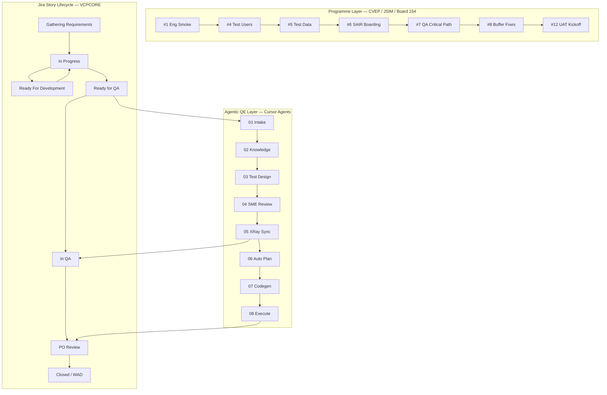

# VikingCloud End-to-End Quality Engineering Flow

**Aligned to:** VCPCORE delivery practice, Board 154 programme model, milestone-gated releases, and Agentic QE framework.

**Systems:** Jira Cloud · Confluence · XRay · Cursor Agents · INT/UAT (`asgard-int`) · SAIR · CI (GitHub Actions/Jenkins)

---

## 1. Process Overview

VikingCloud QE operates across **three synchronized layers**:

| Layer | What it governs |
|-------|-----------------|
| **Programme / Release** | Milestone gates (#1–#12), deployment scope, CXO reporting |
| **Sprint / Jira** | Story lifecycle on Board 154, sprint lanes, filters |
| **Agentic QE** | AI-assisted test design → XRay → automation → defects |



---

## 2. VikingCloud Jira Story Lifecycle

### 2.1 Status Flow (VCPCORE — observed on Board 154)

| Order | Jira Status | Owner | Entry Criteria | Exit Criteria |
|-------|-------------|-------|----------------|---------------|
| 1 | **Gathering Requirements** | PO / PM | Epic scoped | AC drafted, epic linked |
| 2 | **Ready For Development** | PO | DoR met | Dev picks up |
| 3 | **In Progress** | Dev | Sprint commitment | Code complete, unit tests pass |
| 4 | **Ready for QA** | Dev → QE | DoD met, deployed to INT | **Agentic intake trigger** |
| 5 | **In QA** | QE / QA SME | TCs in XRay, TE created | Execution complete, no P1/P2 open |
| 6 | **PO Review** | PO | Spec vs defect ambiguity | PO decision documented |
| 7 | **Closed** | QE / Dev | All gates passed | Release-ready or WAD |

### 2.2 Definition of Ready (DoR) — VikingCloud

Before **Ready For Development**:

- [ ] Acceptance Criteria testable and unambiguous
- [ ] Definition of Done present on story
- [ ] Epic / programme link (`programmeName=CVEP` or `JSIM`)
- [ ] Component label (`vcp-subscription-service`, `VCPCORE`, etc.)
- [ ] Priority set (P1 Deal Breaker → P4 Nice to Have)
- [ ] No blockers; PM/PO grooming complete

### 2.3 Definition of Done (DoD) — VikingCloud

Before **Ready for QA**:

- [ ] Unit tests pass in CI
- [ ] Deployed to INT (`asgard-int.vikingcloud.com`)
- [ ] API documented in Confluence (if applicable)
- [ ] No known P1 regressions on component
- [ ] Dev self-test notes in Jira comment

### 2.4 Priority Scale (VikingCloud)

| Priority | Label | QE Treatment |
|----------|-------|--------------|
| **P1** | Deal Breaker | Mandatory SME + peer sign-off; automation P1 |
| **P2** | Critical | SME review required; PO decision if open at release |
| **P3** | Highly Desirable | Standard agentic flow |
| **P4** | Nice to Have | Manual-only acceptable |

---

## 3. Programme Milestone Gates (Release Train)

Used for programme deliveries (e.g., CVEP Jul 2026, Board 154).

| Gate | Name | Owner | Purpose | QE Dependency |
|------|------|-------|---------|---------------|
| **#1** | Engineering Smoke | Eng Lead | INT stable, smoke pass | Blocks all QA |
| **#4** | Internal Test Users | PM | Testers briefed | UAT readiness |
| **#5** | Test Data | PM / QE | Gmail aliases, URLs, JSIM targets | Data-centric TCs |
| **#6** | SAIR Boarding Files | Ops | MERCHANT + SUBSCRIPTION xlsx | Boarding E2E tests |
| **#7** | QA Critical Path | **Director QE** | E2E merchant journey validation | **Primary QE gate** |
| **#8** | Buffer Fixes | Eng + QE | Post-#7 remediation | Regression suite |
| **#12** | UAT Kickoff | PM + QE | Production dummy-merchant UAT | UAT agent scenarios |

### Milestone #7 Exit Criteria (QA Critical Path)

- Gates #1–#6 green
- Programme definitions deployed (e.g., VCPCORE-1025)
- No P0/P1 blockers on critical-path Jira filter
- CVEP + JSIM tracks: boarding → activation → primary feature smoke
- Tier 1 customer bugs Pass or Accepted risk documented
- XRay Test Set **XR-16269** (or programme equivalent) core scenarios green

---

## 4. Agentic QE Flow — Mapped to VikingCloud

### Phase 0: Pre-QE (VikingCloud Standard)

| Step | Activity | Team | Tool |
|------|----------|------|------|
| 0.1 | PM/PO grooming, AC authoring | PO, PM | Jira, Confluence |
| 0.2 | Sprint planning — Board 154 lane | PM, Eng, QE Lead | Jira Board 154 |
| 0.3 | Dev implementation + unit tests | Dev | Git, CI |
| 0.4 | Deploy to INT | DevOps | `asgard-int` |
| 0.5 | Dev moves story → **Ready for QA** | Dev | Jira |

**Trigger:** Story status = `Ready for QA` → **Story Context Agent** activates.

---

### Phase 1: Story Intake (Agent)

| | |
|---|---|
| **Agent** | Story Context Agent |
| **VikingCloud Gate** | Gate 1 — PO Scope Confirmation (DoR validation) |
| **Accountable** | PO |
| **Inputs** | Jira key, description, AC, DOD, component, programme, epic |
| **Outputs** | Structured requirement model, AC coverage index |
| **Measurable** | 100% AC/DOD parsed |

---

### Phase 2: Knowledge Retrieval (Agent)

| | |
|---|---|
| **Agent** | Knowledge Retrieval Agent |
| **VikingCloud Gate** | Gate 2 — SME Source Validation |
| **Accountable** | QA SME |
| **Inputs** | Confluence (PRD, JSIM Testing Info), customer bugs (90d JQL), architecture docs |
| **Outputs** | RAG context bundle with source citations |
| **Measurable** | ≥3 relevant sources per story |

**VikingCloud sources:**
- Confluence: `/wiki/spaces/VC/`, `/wiki/spaces/CPE/`, PRD pages
- Jira JQL: escaped defects, component bugs, regression history
- SAIR boarding specs for merchant/subscription flows

---

### Phase 3: Test Design (Multi-Agent)

| | |
|---|---|
| **Agents** | Test Design + Security + UAT Agents |
| **Accountable** | QE Lead |
| **Outputs** | 8 labeled TC categories per story |
| **Measurable** | TC draft < 15 min; 8 taxonomy labels applied |

| Label | VikingCloud Example |
|-------|---------------------|
| `functional` | Merchant theme POST returns 200 |
| `security` | Auth0/Keycloak boundary on INT |
| `uat` | CVEP boarding → activation E2E |
| `regression` | VCPCORE-1314 drawer Escape key |
| `data-centric` | SAIR MERCHANT xlsx validation |
| `api-contract` | `vcp-subscription-service` OpenAPI |

---

### Phase 4: QA SME Review (Human — Mandatory)

| | |
|---|---|
| **Agent** | Review Orchestrator (coverage matrix) |
| **VikingCloud Gate** | Gate 3 — QA SME Test Review |
| **Accountable** | QA SME (P1: peer sign-off required) |
| **Checklist** | AC 100% mapped · security for trust boundaries · no duplicates · labels match taxonomy |
| **Reject path** | → Phase 3 rework |
| **Approve path** | → Phase 5 XRay |

---

### Phase 5: XRay Publication (Agent + Human)

| | |
|---|---|
| **Agent** | XRay Sync Agent |
| **VikingCloud Gate** | Gate 4 — QE Lead Publish Approval |
| **Accountable** | QE Lead |
| **Outputs** | XRay tests linked to Jira story; TE created for sprint |
| **Measurable** | 100% Jira → XRay traceability |

**VikingCloud XRay practice:**
- Test Executions (TEs) per epic/sprint (e.g., XR-32899)
- Programme Test Sets (e.g., **XR-16269** critical path)
- Story moves to **In QA** after XRay publish

---

### Phase 6: Automation Planning (Agent + SDET)

| | |
|---|---|
| **Agent** | Automation Scout |
| **VikingCloud Gate** | Gate 5 — SDET Prioritization |
| **Accountable** | SDET Lead |
| **Rule** | P1/P2 functional + api-contract → automation candidates |
| **Measurable** | ≥70% P1/P2 coverage target |

---

### Phase 7: Script Generation (Agent + SDET Review)

| | |
|---|---|
| **Agent** | Codegen Agent |
| **VikingCloud Gate** | Gate 6 — SDET Code Review |
| **Accountable** | SDET |
| **Outputs** | Cypress/Playwright PR linked to XRay key |
| **Standards** | `data-testid` selectors, page objects, INT env config |
| **Measurable** | ≥85% first-pass PR approval |

---

### Phase 8: Execute & Defect Management (Agent + Human)

| | |
|---|---|
| **Agents** | Execution Agent + Defect Triage Agent |
| **VikingCloud Gate** | Gate 7 — Dev Defect Triage |
| **Accountable** | Dev (triage), QE (verify) |
| **Environment** | INT (`asgard-int.vikingcloud.com`), YOURBANK test client |
| **Outputs** | CI report; Jira bugs with VikingCloud labels |

**Auto-defect Jira labels:**
```
auto-filed, qe-agent, found-in-automation, component:{name},
severity:{level}, xray-test:{key}, programme:{CVEP|JSIM}
```

**Defect routing:**
- Product defect → Dev, status **Ready For Development** or **In Progress**
- Spec ambiguity → **PO Review**
- Works as designed → **Closed (WAD)**

---

## 5. End-to-End Swimlane (Single Story)

```
PO/PM          Dev              Agentic QE           QA SME        SDET         DevOps
  │             │                    │                  │            │             │
  ├─ Groom AC ──┤                    │                  │            │             │
  ├─ Sprint plan (Board 154)         │                  │            │             │
  │             ├─ In Progress       │                  │            │             │
  │             ├─ Deploy INT ───────┼──────────────────┼────────────┼────────────►│
  │             ├─ Ready for QA ────►│                  │            │             │
  │             │                    ├─ 01 Intake        │            │             │
  │             │                    ├─ 02 Knowledge     │            │             │
  │             │                    ├─ 03 Design (8TC)  │            │             │
  │             │                    ├─ 04 Review ───────►│ Approve    │             │
  │             │                    ├─ 05 XRay publish   │            │             │
  │             │                    │    → In QA ───────┼────────────┤             │
  │             │                    ├─ 06 Auto plan ────┼───────────►│ Prioritize  │
  │             │                    ├─ 07 Codegen ──────┼───────────►│ PR review   │
  │             │                    ├─ 08 Execute CI ───┼────────────┼────────────►│
  │             │◄── Defect filed ───┤ (if product bug)  │            │             │
  │◄─ PO Review ┤ (if spec issue)    │                  │            │             │
  ├─ Closed/WAD ┤                    │                  │            │             │
```

---

## 6. Sprint Cadence & Governance (VikingCloud)

| Cadence | Activity | Participants | Output |
|---------|----------|--------------|--------|
| **Sprint Planning** | Board 154 lane commitment | PM, Eng, QE Lead | Sprint backlog with RFQ forecast |
| **Daily** | Blocker triage | Squad | Jira updates |
| **Mid-sprint** | Agentic TC draft for incoming RFQ stories | QE, Agents | XRay-ready TCs |
| **Sprint Review** | Demo + TE results | All squad | Pass/Fail/TODO metrics |
| **Sprint Retro** | Agent accuracy review | QE Lead, QA SME | Prompt tuning |
| **Weekly** | QA Executive Update / CXO report | Director QE | Board 154 health, escape defects |
| **Monthly** | Quality Summit | QE, PM, Eng leadership | Governance, capacity, KPIs |

### Key Jira Filters (VCPCORE)

| Filter | ID | Use |
|--------|-----|-----|
| Deployment scope | 15731 | Release boundary |
| Open at risk | 15732 | Critical-path blockers |
| All bugs | 16740 | QA health report |
| P2 critical active | 16743 | Executive decisions |

---

## 7. RACI — VikingCloud Activities

| Activity | PO | QA SME | QE Lead | SDET | Dev | QE Ops | Agent |
|----------|----|----|---------|------|-----|--------|-------|
| DoR / Grooming | A | C | C | I | I | I | — |
| Ready for QA handoff | C | I | I | I | R | I | — |
| Story Intake | C | I | I | I | I | C | R |
| Knowledge Retrieval | C | A | C | I | I | I | R |
| TC Generation | I | C | A | I | I | I | R |
| SME Review | I | A | C | C | I | I | C |
| XRay Publish | I | C | A | I | I | R | R |
| In QA Execution | I | R | C | C | C | I | R |
| Automation Codegen | I | I | C | A | C | I | R |
| Defect Triage | C | C | I | C | A | I | R |
| Milestone #7 sign-off | C | C | A | C | C | I | C |
| CXO QA Report | I | C | A | I | I | R | C |

---

## 8. Measurables (VikingCloud KPIs)

| KPI | Target | Owner | Source |
|-----|--------|-------|--------|
| TC draft time / story | < 15 min | QE Lead | Agent logs |
| AC coverage at SME review | 100% | QA SME | Coverage matrix |
| XRay TE Pass rate (programme) | ≥ 95% core scenarios | QE Lead | XRay GraphQL |
| Jira → XRay link completeness | 100% | QE Ops | XRay report |
| P1/P2 automation coverage | ≥ 70% | SDET Lead | Git + XRay |
| Open P2 at release gate | 0 (or PO Accepted) | Director QE | Filter 15732 |
| Escape defect rate | Trend down QoQ | Director QE | Jira escaped-defect JQL |
| Milestone #7 on-time | Per programme plan | Director QE | Programme tracker |

---

## 9. Environment & Test Data (VikingCloud)

| Asset | Value / Location |
|-------|------------------|
| **INT Portal** | `asgard-int.vikingcloud.com` |
| **Test Client** | `YOURBANK` (`clientCode=YOURBANK`) |
| **SAIR Boarding** | MERCHANT + SUBSCRIPTION xlsx via Lenny/Ops |
| **JSIM Targets** | Checkout page URLs per Confluence JSIM page |
| **Auth** | Auth0 / Keycloak (Sprint 6140) |
| **Confluence** | `vikingcloud.atlassian.net/wiki` |

---

## 10. Agentic QE ↔ VikingCloud Status Mapping

| Agentic Phase | Jira Status (typical) | XRay Action |
|---------------|----------------------|-------------|
| 01 Intake | Ready for QA | — |
| 02 Knowledge | Ready for QA | — |
| 03 Design | Ready for QA | Draft TCs |
| 04 Review | Ready for QA | Pending approval |
| 05 XRay Sync | **In QA** | Create tests + TE |
| 06 Auto Plan | In QA | Tag automation candidates |
| 07 Codegen | In QA | Link PR to XRay |
| 08 Execute | In QA → PO Review / Closed | Update TE results, file bugs |

---

## Appendix A — Programme Sprint Lanes (Board 154)

| Sprint ID | Lane |
|-----------|------|
| 4371 | JSIM Phase 1 |
| 5286 | Insurance service |
| 5557 | JSIM Standalone |
| 5957 | Scamnetic integration |
| 5958 | VCP UI Redesign |
| 5991 | VCP Marketplace payments |
| 6140 | Auth0/Keycloak |

---

## Appendix B — Rollout (Agentic QE into VikingCloud)

| Phase | Duration | Scope |
|-------|----------|-------|
| Pilot | Weeks 1–4 | 1 Board 154 squad, 10 RFQ stories |
| Integrate | Weeks 5–10 | XRay MCP, milestone #7 alignment |
| Automate | Weeks 11–18 | Codegen MCP, INT CI execution |
| Scale | Ongoing | All programme lanes, Quality Summit KPIs |
